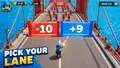
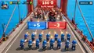
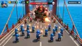
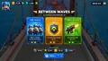
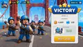
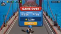
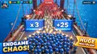
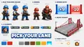
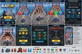
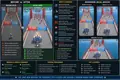

# BLASTLINE Art References

These are generated **visual targets** for BLASTLINE. They are not screenshots from the live game and they are not production/runtime textures.

The repository copies are lightweight WebP previews so this reference library stays friendly to a static Cloudflare Pages deployment. Use the composition, proportions, UI hierarchy, palette, effects, and overall art direction as implementation guidance; production game assets belong under `/assets`.

## Reference set

1. **Gameplay / lane choice** — bridge camera, player scale, red/blue gates, enemy staging, compact HUD.
2. **Elite wave** — higher enemy density, larger elite silhouettes, stronger danger/readability.
3. **Boss battle** — boss scale, formation composition, muzzle flashes, boss-health presentation.
4. **Between-waves upgrades** — three-card upgrade choice and readable overlay hierarchy.
5. **Victory screen** — reward presentation, celebratory characters, clear next-level CTA.
6. **Game over** — failure state, score hierarchy, retry CTA.
7. **Endgame chaos** — upper bound for troop density, multipliers and visual spectacle.
8. **Character/environment style guide** — soldier shapes, enemy tiers, gate construction, bridge language, palette and combat VFX.
9. **Static-web game concept sheet** — end-to-end reference designed around an HTML5 Canvas/CSS/static-asset implementation.
10. **Before/after visual target** — quality benchmark for perspective, density, scale, effects and polish.

## Gallery

## Implementation constraint

The art direction should be reproduced with static-friendly techniques: HTML5 Canvas/WebGL rendering, CSS UI, compressed PNG/WebP sprites, procedural particles, screen shake, gradients, shadows and a small number of reusable environment assets. Do not require a game server or heavyweight backend just to match these visuals.
