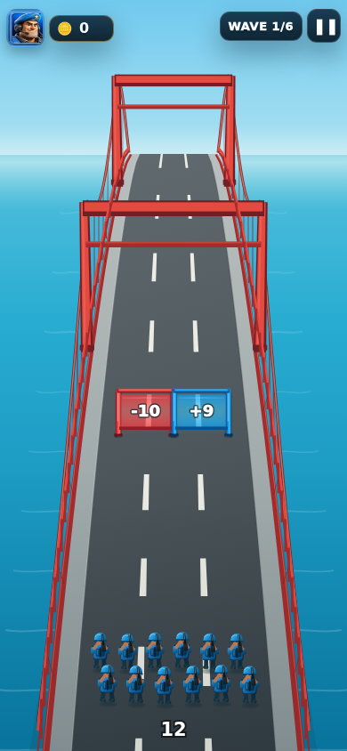
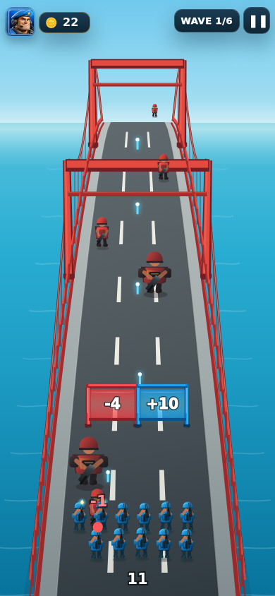
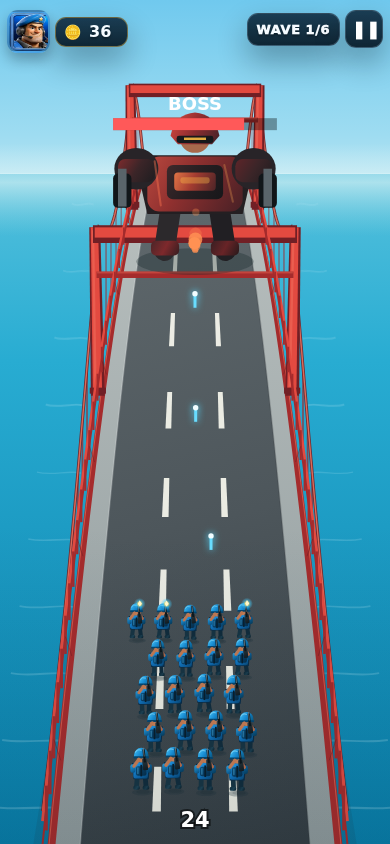
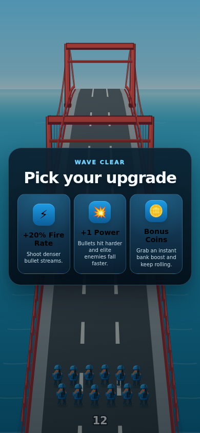
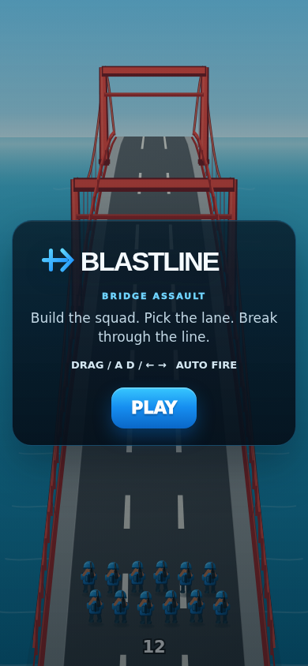
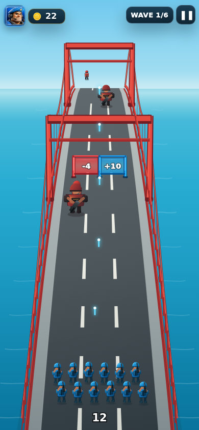
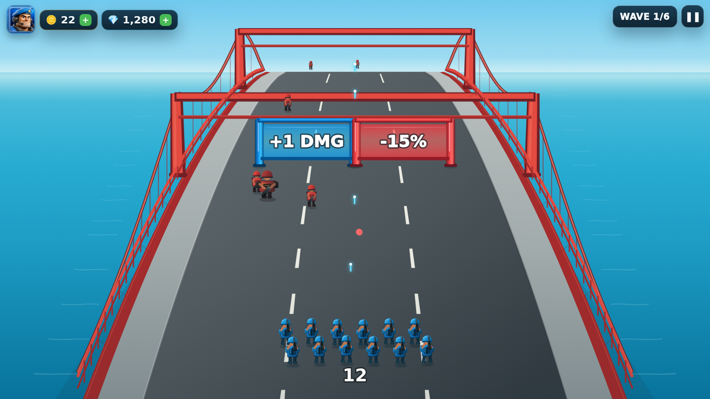

# BLASTLINE Batch 12 comparison index

Every **Actual** image below is a direct Chromium screenshot from the production game. Every **Reference** image is an untouched repository fallback reference preview. No generated/redrawn current-site image is used.

## Lane choice

| Reference target | Actual production game |
|---|---|
|  |  |

## Elite wave

| Reference target | Actual production game |
|---|---|
|  |  |

## Boss battle

| Reference target | Actual production game |
|---|---|
|  |  |

## Upgrade screen

| Reference target | Actual production game |
|---|---|
|  |  |

## Victory

| Reference target | Actual production game |
|---|---|
|  |  |

## Game over

| Reference target | Actual production game |
|---|---|
|  |  |

## Home / overall polish

| Reference target | Actual production game |
|---|---|
|  |  |
|  |  |

## Desktop evidence

Because the fallback references are only 120 px wide, these comparisons are valid for broad composition/style direction but not for pixel-level or source-asset inspection. That limitation is why the final scorecard does not award 4–5/5 to categories that require real production sheet fidelity.
